# EduAxis - Complete Entity Relationship Diagram

This diagram shows all 26 database models with their relationships, primary keys, foreign keys, and key fields.

## View Instructions
- Open in VS Code with Mermaid extension
- Copy code to [mermaid.live](https://mermaid.live) to export as PNG/SVG/PDF
- Use `mmdc -i 01-entity-relationship-diagram.md -o erd.png` with Mermaid CLI

```mermaid
erDiagram
    School ||--o{ User : "has many"
    School ||--o{ Course : "has many"
    School ||--o{ Enrollment : "has many"
    School ||--o{ Assignment : "has many"
    School ||--o{ Attendance : "has many"
    School ||--o{ Fee : "has many"
    School ||--o{ Payment : "has many"
    School ||--o{ Message : "has many"
    School ||--o{ Announcement : "has many"
    School ||--o{ LibraryResource : "has many"
    School ||--o{ Quiz : "has many"
    School ||--o{ Timetable : "has many"
    
    User ||--o{ Course : "teaches"
    User ||--o{ Enrollment : "enrolls in"
    User ||--o{ Assignment : "creates"
    User ||--o{ Submission : "submits"
    User ||--o{ Attendance : "records"
    User ||--o{ Message : "sends"
    User ||--o{ Message : "receives"
    User ||--o{ QuizAttempt : "attempts"
    User ||--o{ Payment : "makes"
    User ||--o{ Feedback : "provides"
    User ||--o{ LeaveRequest : "requests"
    
    Course ||--o{ Enrollment : "has"
    Course ||--o{ Module : "contains"
    Course ||--o{ Assignment : "has"
    Course ||--o{ Attendance : "tracks"
    Course ||--o{ Quiz : "includes"
    Course ||--o{ StudyMaterial : "has"
    Course ||--o{ Grade : "has"
    Course ||--o{ PerformanceAnalytic : "tracks"
    Course ||--o{ Schedule : "schedules"
    
    Assignment ||--o{ Submission : "receives"
    
    Module ||--o{ Quiz : "contains"
    
    Quiz ||--o{ QuizAttempt : "tracks"
    
    Fee ||--o{ Payment : "paid by"
    
    Enrollment ||--o{ PerformanceAnalytic : "generates"
    
    School {
        ObjectId _id PK
        string name
        string code UK
        string email
        string phone
        object address
        string status
        object subscription
        object billing
        object stats
    }
    
    User {
        ObjectId _id PK
        string name
        string email UK
        string password
        string role
        ObjectId schoolId FK
        string studentId UK
        string teacherId UK
        string grade
        string status
    }
    
    Course {
        ObjectId _id PK
        ObjectId schoolId FK
        string name
        string code UK
        ObjectId teacherId FK
        number grade
        number credits
        string status
    }
    
    Enrollment {
        ObjectId _id PK
        ObjectId schoolId FK
        ObjectId studentId FK
        ObjectId courseId FK
        string status
        string grade
        number marks
    }
    
    Assignment {
        ObjectId _id PK
        ObjectId schoolId FK
        string title
        ObjectId teacherId FK
        ObjectId courseId FK
        date dueDate
        number totalMarks
        string status
    }
    
    Submission {
        ObjectId _id PK
        ObjectId schoolId FK
        ObjectId assignmentId FK
        ObjectId studentId FK
        array files
        number marks
        string status
    }
    
    Attendance {
        ObjectId _id PK
        ObjectId schoolId FK
        ObjectId studentId FK
        ObjectId courseId FK
        date date
        string status
        ObjectId markedBy FK
    }
    
    Fee {
        ObjectId _id PK
        ObjectId schoolId FK
        string title
        number amount
        date dueDate
        string status
    }
    
    Payment {
        ObjectId _id PK
        ObjectId schoolId FK
        ObjectId studentId FK
        ObjectId feeId FK
        number amount
        string paymentMethod
        string status
    }
    
    Grade {
        ObjectId _id PK
        ObjectId schoolId FK
        ObjectId studentId FK
        ObjectId courseId FK
        string subject
        number score
        string type
    }
    
    Quiz {
        ObjectId _id PK
        ObjectId schoolId FK
        ObjectId courseId FK
        ObjectId moduleId FK
        string title
        array questions
        number totalMarks
    }
    
    QuizAttempt {
        ObjectId _id PK
        ObjectId schoolId FK
        ObjectId quizId FK
        ObjectId studentId FK
        number score
        string status
        array answers
    }
    
    Message {
        ObjectId _id PK
        ObjectId schoolId FK
        ObjectId sender FK
        ObjectId recipient FK
        string text
        string status
    }
    
    LibraryResource {
        ObjectId _id PK
        ObjectId schoolId FK
        string title
        string category
        object file
        boolean isActive
    }
    
    Announcement {
        ObjectId _id PK
        ObjectId schoolId FK
        string title
        string content
        ObjectId createdBy FK
        string targetAudience
        string priority
    }
    
    Module {
        ObjectId _id PK
        ObjectId schoolId FK
        ObjectId courseId FK
        string title
        number order
        string status
    }
    
    StudyMaterial {
        ObjectId _id PK
        ObjectId schoolId FK
        ObjectId courseId FK
        string title
        number grade
        string fileUrl
    }
    
    Timetable {
        ObjectId _id PK
        ObjectId schoolId FK
        string grade
        string section
        object file
        boolean isActive
    }
    
    Schedule {
        ObjectId _id PK
        ObjectId schoolId FK
        ObjectId teacherId FK
        ObjectId courseId FK
        string dayOfWeek
        string startTime
        string endTime
    }
    
    Feedback {
        ObjectId _id PK
        ObjectId schoolId FK
        ObjectId studentId FK
        ObjectId courseId FK
        object rating
        string comments
        string status
    }
    
    LeaveRequest {
        ObjectId _id PK
        ObjectId schoolId FK
        ObjectId requesterId FK
        date startDate
        date endDate
        string status
    }
    
    PerformanceAnalytic {
        ObjectId _id PK
        ObjectId schoolId FK
        ObjectId studentId FK
        ObjectId courseId FK
        number overallScore
        object assignments
        object tests
        string riskLevel
    }
    
    AuditLog {
        ObjectId _id PK
        ObjectId schoolId FK
        ObjectId userId FK
        string action
        string resource
        object changes
    }
    
    PricingPlan {
        ObjectId _id PK
        string code UK
        string name
        number monthlyPrice
        number annualPrice
        number maxStudents
        array features
    }
```

