# EduAxis - System Architecture

Multi-layered architecture showing the complete tech stack from frontend to database.

## Layers
- **Frontend Layer**: React-based user interfaces
- **API Layer**: Express.js RESTful routes
- **Middleware Layer**: Security, authentication, file handling
- **Business Logic**: Controllers handling business rules
- **Data Layer**: MongoDB models
- **External Services**: File storage and real-time communication

```mermaid
graph TB
    subgraph "Frontend Layer"
        LP[Landing Page]
        Login[Login/Register]
        SD[Student Dashboard]
        TD[Teacher Dashboard]
        AD[Admin Dashboard]
        SAD[Super Admin Dashboard]
    end
    
    subgraph "API Layer - Express.js"
        AuthAPI[Auth Routes]
        StudentAPI[Student Routes]
        TeacherAPI[Teacher Routes]
        AdminAPI[Admin Routes]
        SuperAPI[Super Admin Routes]
        MessageAPI[Message Routes]
        QuizAPI[Quiz Routes]
        EnrollAPI[Enrollment Routes]
        FeedbackAPI[Feedback Routes]
        AnalyticsAPI[Analytics Routes]
    end
    
    subgraph "Middleware Layer"
        AuthMW[JWT Authentication]
        TenantMW[Tenant Guards]
        ErrorMW[Error Handler]
        UploadMW[File Upload - Multer]
        LogMW[Request Logger]
        RateMW[Rate Limiter]
        CSRFMW[CSRF Protection]
    end
    
    subgraph "Business Logic"
        AuthCtrl[Auth Controller]
        StudentCtrl[Student Controller]
        TeacherCtrl[Teacher Controller]
        AdminCtrl[Admin Controller]
        SuperCtrl[Super Admin Controller]
        MessageCtrl[Message Controller]
        QuizCtrl[Quiz Controller]
        EnrollCtrl[Enrollment Controller]
        FeedbackCtrl[Feedback Controller]
        AnalyticsCtrl[Analytics Controller]
    end
    
    subgraph "Data Layer - MongoDB"
        UserDB[(User Model)]
        SchoolDB[(School Model)]
        CourseDB[(Course Model)]
        EnrollDB[(Enrollment Model)]
        AssignDB[(Assignment Model)]
        AttendDB[(Attendance Model)]
        GradeDB[(Grade Model)]
        FeeDB[(Fee Model)]
        PaymentDB[(Payment Model)]
        QuizDB[(Quiz Model)]
        MessageDB[(Message Model)]
        LibraryDB[(Library Model)]
        PerformDB[(Performance Model)]
        AuditDB[(Audit Log)]
    end
    
    subgraph "External Services"
        FileStore[File Storage System]
        Socket[Socket.IO Real-time]
    end
    
    LP --> Login
    Login --> AuthAPI
    SD --> StudentAPI
    TD --> TeacherAPI
    AD --> AdminAPI
    SAD --> SuperAPI
    
    AuthAPI --> AuthMW
    StudentAPI --> AuthMW
    TeacherAPI --> AuthMW
    AdminAPI --> AuthMW
    SuperAPI --> AuthMW
    MessageAPI --> AuthMW
    
    AuthMW --> TenantMW
    TenantMW --> LogMW
    LogMW --> RateMW
    
    RateMW --> AuthCtrl
    RateMW --> StudentCtrl
    RateMW --> TeacherCtrl
    RateMW --> AdminCtrl
    RateMW --> SuperCtrl
    
    UploadMW --> StudentCtrl
    UploadMW --> TeacherCtrl
    
    AuthCtrl --> UserDB
    AuthCtrl --> SchoolDB
    StudentCtrl --> EnrollDB
    StudentCtrl --> AssignDB
    StudentCtrl --> GradeDB
    StudentCtrl --> FeeDB
    StudentCtrl --> PaymentDB
    TeacherCtrl --> CourseDB
    TeacherCtrl --> AttendDB
    TeacherCtrl --> GradeDB
    AdminCtrl --> UserDB
    AdminCtrl --> CourseDB
    AdminCtrl --> FeeDB
    SuperCtrl --> SchoolDB
    SuperCtrl --> PerformDB
    
    MessageCtrl --> MessageDB
    MessageCtrl --> Socket
    QuizCtrl --> QuizDB
    AnalyticsCtrl --> PerformDB
    
    StudentCtrl --> FileStore
    TeacherCtrl --> FileStore
    
    style AuthMW fill:#ff9999
    style TenantMW fill:#ff9999
    style SchoolDB fill:#99ccff
    style UserDB fill:#99ccff
```

