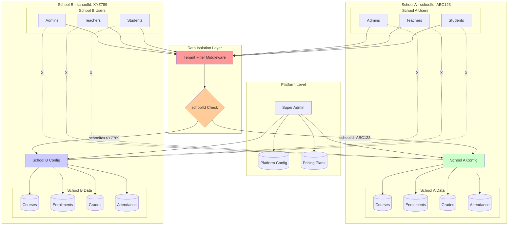

# EduAxis - Multi-Tenant Architecture

Demonstrates complete data isolation between schools using schoolId-based filtering.

## Key Features
- **Data Isolation**: Each school's data is completely separated
- **Tenant Filter**: Middleware automatically filters all queries by schoolId
- **Cross-School Prevention**: Users cannot access data from other schools
- **Super Admin Access**: Platform-level management across all schools

