# EduAxis - User Role Flow Diagram

Comprehensive feature map showing all available functions for each user role.

## User Roles
1. **Super Admin** - Platform-wide management
2. **Admin** - School-level management
3. **Teacher** - Course and student management
4. **Student** - Learning and academic tracking

```mermaid
graph LR
    Start([User Access]) --> Login{User Login}
    
    Login -->|SuperAdmin| SADash[Super Admin Dashboard]
    Login -->|Admin| ADash[Admin Dashboard]
    Login -->|Teacher| TDash[Teacher Dashboard]
    Login -->|Student| SDash[Student Dashboard]
    
    subgraph "Super Admin Functions"
        SADash --> SASchools[Manage Schools]
        SADash --> SAUsers[View All Users]
        SADash --> SAAnalytics[Platform Analytics]
        SADash --> SAPricing[Manage Pricing Plans]
        SADash --> SABilling[Monitor Subscriptions]
        
        SASchools --> SACreate[Create School]
        SASchools --> SAUpdate[Update School]
        SASchools --> SASuspend[Suspend School]
        SASchools --> SADelete[Delete School]
    end
    
    subgraph "Admin Functions"
        ADash --> AUsers[User Management]
        ADash --> ACourses[Course Management]
        ADash --> AFees[Fee Management]
        ADash --> AAnnounce[Announcements]
        ADash --> AAnalytics[School Analytics]
        
        AUsers --> ACreateUser[Create Users]
        AUsers --> AEditUser[Edit Users]
        AUsers --> ADeleteUser[Delete Users]
        
        ACourses --> ACreateCourse[Create Courses]
        ACourses --> AAssignTeacher[Assign Teachers]
        
        AFees --> ASetFees[Set Fee Structure]
        AFees --> AViewPayments[View Payments]
    end
    
    subgraph "Teacher Functions"
        TDash --> TCourses[My Courses]
        TDash --> TAssign[Assignments]
        TDash --> TAttend[Attendance]
        TDash --> TGrade[Grading]
        TDash --> TMessage[Messages]
        TDash --> TAnalytics[Student Analytics]
        
        TCourses --> TView[View Course Details]
        TCourses --> TStudents[View Students]
        
        TAssign --> TCreate[Create Assignment]
        TAssign --> TReview[Review Submissions]
        TAssign --> TGrades[Grade Submissions]
        
        TAttend --> TMark[Mark Attendance]
        TAttend --> TReport[Attendance Reports]
        
        TGrade --> TEnter[Enter Grades]
        TGrade --> TFeedback[Provide Feedback]
    end
    
    subgraph "Student Functions"
        SDash --> SCourses[My Courses]
        SDash --> SAssign[Assignments]
        SDash --> SGrades[My Grades]
        SDash --> SAttend[My Attendance]
        SDash --> SFees[Fee Status]
        SDash --> SLibrary[Library]
        SDash --> SMessage[Messages]
        SDash --> STimetable[Timetable]
        
        SCourses --> SEnroll[Enrolled Courses]
        SCourses --> SMaterial[Study Materials]
        SCourses --> SQuiz[Take Quiz]
        
        SAssign --> SView[View Assignments]
        SAssign --> SSubmit[Submit Work]
        SAssign --> SStatus[Check Status]
        
        SGrades --> SViewGrades[View All Grades]
        SGrades --> SProgress[Track Progress]
        
        SFees --> SViewFees[View Fees]
        SFees --> SPayment[Make Payment]
        SFees --> SReceipt[Download Receipt]
        
        SLibrary --> SBrowse[Browse Resources]
        SLibrary --> SDownload[Download Materials]
    end
    
    style SADash fill:#ff9999
    style ADash fill:#ffcc99
    style TDash fill:#99ccff
    style SDash fill:#99ff99
```

