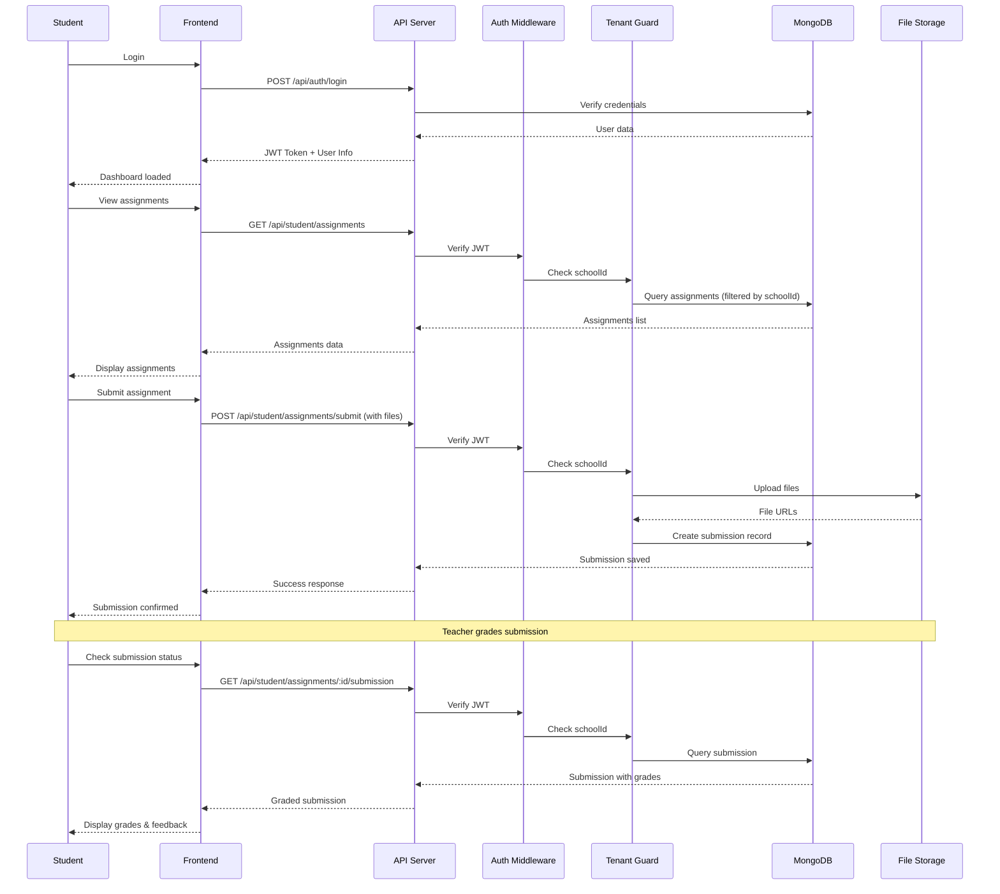

# EduAxis - Student Assignment Flow

Sequence diagram showing the complete lifecycle of a student assignment submission.

## Flow Steps
1. Student login and authentication
2. View available assignments (filtered by schoolId)
3. Submit assignment with file uploads
4. Teacher grades submission
5. Student views graded submission with feedback

