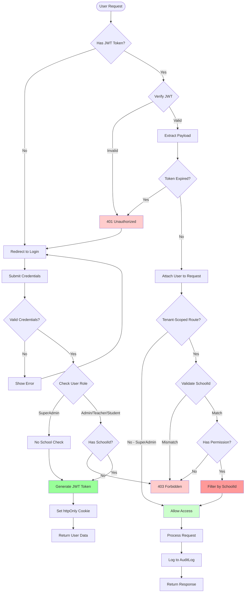

# EduAxis - Authentication & Authorization Flow

Detailed security flow showing JWT authentication and role-based access control with tenant isolation.

## Security Features
- JWT token-based authentication
- Role-based access control (RBAC)
- School-level tenant isolation
- Permission validation
- Audit logging

