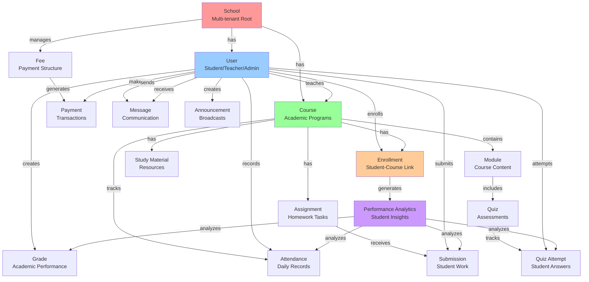

# EduAxis - Data Model Core Relationships

Simplified relationship diagram focusing on the core data model connections.

## Key Relationships
- **School** → Central multi-tenant root entity
- **User** → Multi-role entity (student/teacher/admin/superadmin)
- **Course** → Academic program container
- **Enrollment** → Links students to courses
- **Performance Analytics** → Aggregates student performance data

