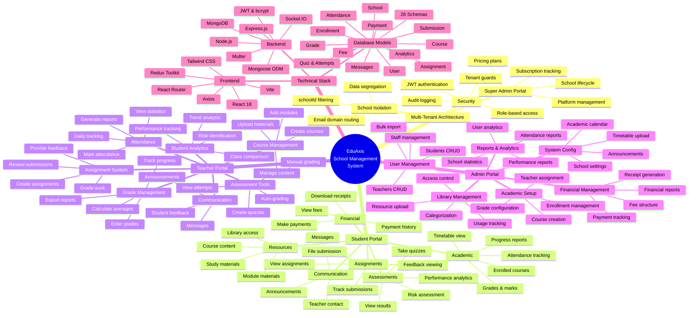

# EduAxis - Complete Feature Mind Map

Comprehensive mind map showing all features organized by role and technical components.

## Contents
- Multi-Tenant Architecture
- Student Portal Features
- Teacher Portal Features
- Admin Portal Features
- Technical Stack Components

